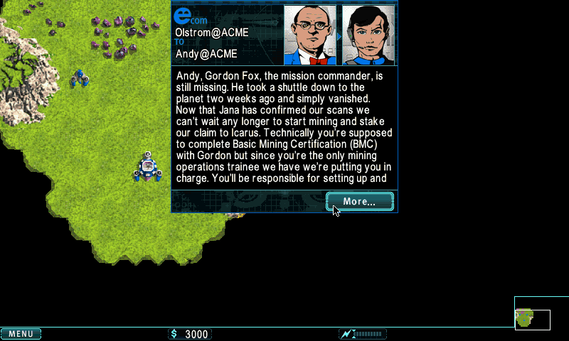

## About

*Hostile Takeover* is the open source release of the wildly popular mobile Real Time Strategy game *Warfare Incorporated*. Warfare Incorporated's developers, grateful for all the contributions of the open source community, are delighted to give something back.

#### Legal Stuff
*Hostile Takeover* and *Warfare Incorporated* are registered trademarks of *Spiffcode, Inc* the developers of Warfare Incorporated. *Hostile Takeover* is copyrighted 2004-2014 by Spiffcode, Inc. The Hostile Takeover source code is made available under the [BSD open source license](LICENSE.txt).

## Building

### Prerequisites for OpenPandora
- OpenPandora
- latest Codeblocks (but other dev. tools should work)

### Building the Hostile Takeover Executable for OpenPandora
From codeblocks command line, go to your hostile-takeover folder
- `cd game`
- `make -f makefile.pandora`
- run it with `linux_rel/ht` on your device

### Prerequisites for Dragonbox Pyra
- Pyra
- you'll need some dev tools and squashfs to build dbp (`sudo apt install build-essential libsld1.2-dev squashfs-tools` should do the trick)

### Building the Hostile Takeover Executable for Pyra
From command line, go to your hostile-takeover folder
- `cd game`
- `make -f makefile.pyra`
- run it with `linux_rel/ht` on your device
- also, you'll have `linux_rel/HostileTakeover.dbp` generated, put it in your `dragonbox/packages` folder

### Building the Hostile Takeover Executable for Linux
You simply need SDL 1.2 as dependancy
- `cd game`
- `make -f makefile.pandora REL=1`
- run it with `linux_rel/WarfareIncorporated` on your device
- or omit the `REL=1` to have a Debug in `linux_debug/`

### Building the Hostile Takeover Data File (not updated/checked on Pandora)
The Hostile Takeover iOS executable incorporates a data file, **htdata832.pdb**, which includes all the art, audio, and levels for the game. A prebuilt version of this data file is already in the source tree so you don't need to build it unless you are modifying assets it contains.

Originally all of Hostile Takeover was developed on Windows using Windows tools like Visual Studio and C#. To build the data file on the Mac, the cross platform Mono framework is used.

1. Install the Mono runtime environment.
	- Available from http://www.go-mono.com/mono-downloads/download.html. Version 3.4 (Mono MRE installer) is known to work.
- `cd data`
- `make IPHONE=1 MULTIPLAYER=1 clean all`
	- some harmless warnings will be displayed
- Mark the data file with a version number.
	- `cd ..`
	- `bin/markversion 1.6`

### Building and running the Hostile Takeover Multiplayer Server (not updated/checked on Pandora)
Hostile Takeover supports single player and multiplayer play. Multiplayer is supported by two server components: a TCP based game server located in the **server** directory, and an HTTP based server located in the **stats** directory used for accounts, leaderboard, game history and game stats.

1. The game server is a command line server which builds can be built and run on OSX or Linux. The game server is does not (currently) build and run on Windows. The production server environment is expected to be Linux based.
- `cd server`
- make REL=1 clean all (for a release build)
- make clean all (for a debug build)

Please refer to the README.txt in the **server** directory for more detailed information on how to run the server environment in development and production.

## Tools
The `bin` directory contains many command line tools used to build the htdata file. There are also GUI tools for editing maps (M) and animations (AniMax).

The GUI tools have primarily been used on Windows and are best described as 'flaky' on the Mac. If you want to give level editing a try on a Mac:

1. `mono bin/m.exe`
- File > Open
- Select a .ld (level description) file from the `data` directory.
- There is an m.chm file for M help. m.chm is a Windows specific file format. There is also an overview on the web found here: http://sites.warfareincorporated.com/mission-authoring/

See [Building the Hostile Takeover Data File](#building-the-hostile-takeover-data-file) for instructions on how to rebuild the data file after making changes to any level, image, sound files or other game assets.
